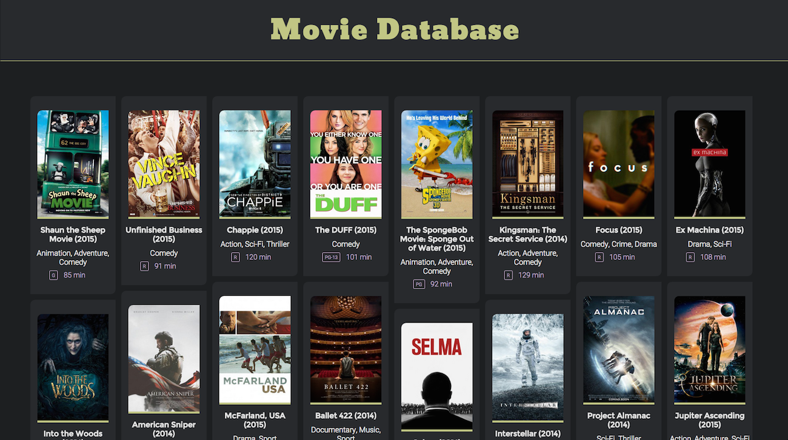

# Movie Cart
A simple shopping cart app for a basic database of movies.
Built on Rails 4, hooked up to a mysql database.

## Specs

### Application Environment

* Rails version: 4.2.1
* Ruby version: 2.2.1-p85 (x86_64-darwin14)
* RubyGems version: 2.4.6
* Rack version: 1.6.1
* JavaScript Runtime: JavaScriptCore
* Database adapter: mysql2

### Gemfile

## Configuration

### Database creation

### Database initialization

## Usage